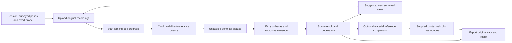

# Frontend handoff: EchoSight 0.2.0

The backend's central claim is that sound can support several independently located 3D reflectors, including height-dependent structure, and that additional surveyed recording positions can resolve or strengthen that inference. It does not claim complete object meshes, measured edges, safe free space or hardware accuracy. The useful demonstration is understanding room layout and consequential early reflections, with visible evidence behind every surface.

## Start with these interfaces

Run `python -m echosight serve --root work/store --port 8765`. [API.md](API.md) specifies the routes, error codes and limits. The pure processing interface is `echosight.pipeline.process_session(session_or_path, cancel, progress)`. JSON schemas are in `schemas/`: session, job and scene result, all `schema_version="1.0"`. Keep session IDs, capture IDs, candidate IDs and result IDs in frontend state. The API currently accepts trusted local clients; a browser frontend needs a deliberate allowed-origin/authentication design or a same-machine server proxy. Do not make this unauthenticated local service public.



Job status and scene status mean different things. A `completed` job may legitimately return `no_result`. Job statuses are `queued`, `running`, `completed`, `failed`, `cancelled`, `interrupted`; scene statuses are `ok`, `partial`, `ambiguous`, `no_result`, `cancelled`. A percentage describes work progress, never confidence. On restart, interrupted jobs retain input and recordings; start a new job. After another capture is uploaded, an earlier scene is marked `stale=true` until reprocessed.

Archive reload preserves raw inputs and quarantines stored computations. `GET result` stays unavailable until a new processing job completes. Session replay metadata reports the archived computation's binding issues without serving its geometry as established evidence. Result provenance includes exact implementation and numerical-library fingerprints; observation `input_diagnostics` preserves acquisition-format limits such as an unverified sample grid.

## Render the actual geometry

All positions use metres, right-handed coordinates, z up. A surface has unit `normal` n and `offset_m` d satisfying n·x=d. `vertices_m` and zero-based `triangles` can populate a mesh directly. Render the source and receiver poses using the same coordinate frame. Surface polygons summarize the convex hull of supported reflection points. Their boundary is **not an inferred physical edge**. Keep `extent_status="unknown"` visible; do not connect patches into a closed room or extrude a floor plan.

Each surface's `support` links a `capture_id` and `candidate_id` to its observed and predicted excess delay, residual and reflection point. Draw source → reflection point → receiver rays when selected. Display measured/predicted delays in milliseconds only by multiplying the stored seconds by 1000. These times are corrected source-buffer intervals; the declared source-clock scale is still needed for physical seconds. Color or opacity may summarize support, but there is no calibrated probability of correctness.

`uncertainty.offset_std_m` and `normal_angular_std_rad` are local standard deviations conditional on one path assignment and first-order point-source model. They include declared shared calibration covariance. They exclude unmodeled source/recorder bias and alternative global explanations. Do not label ±1.96 standard deviations a universally validated 95% interval. `dimensions` measure separation between plane intersections along a specified line through the surveyed source. Render their supplied reference, direction and endpoints. Nonparallel planes have no unique global separation; these measurements are not proof of enclosed room dimensions. Their uncertainty combines shared plane covariance with a conservative reference-position contribution.

When `status="ambiguous"`, definitive `surfaces` is empty. Keep `hypotheses` separate. A hypothesis may contain `surfaces`, `planes` or `image_sources_m`; render available support without inventing extents for a bare plane. Unconfirmed candidates belong in an explicitly qualified overlay, never mixed with confirmed surfaces. Diagnostics may be a code string or `{code,message}`; show the message if present and preserve the code for troubleshooting.

## Evolving the map

Upload additional captures to the same session, then start a new job. Existing recordings are immutable and remain included. Compare saved results with `POST /v1/compare` or `python -m echosight compare old.json new.json --output comparison.json`. The same `coordinate_frame_id`, source, probe and scale are required. Pipeline results default the frame to the session ID; cross-session comparisons require the caller to supply the same surveyed frame explicitly.

`correspondences` links consecutive surface evidence IDs; `current_tracks` supplies the complete display mapping for the current result. For three or more revisions, pass the preceding comparison as `previous_comparison` (CLI: `--previous-comparison`) while keeping both acoustic result exports unchanged. Omitting it starts from the previous result’s own labels and does not preserve older continuity automatically. [Tracking contract and examples](TRACKING.md) define stale-state rejection, births, ended tracks and schema. This is bounded one-to-one display continuity, not guaranteed global physical identity. Surface IDs hash supporting capture/candidate IDs and can change after refinement. The comparison reports additional support, newly supported surfaces, prior surfaces that are no longer confirmed, and ambiguity reduction. It always distinguishes inference changes from physical scene changes. A disappearing estimate does not establish a removed object.

`recommend_next_view(session,result,candidate_positions_m)` scores supplied reachable positions by predicted separation of competing image-source explanations, normalized by declared timing/pose uncertainty. It does not inspect room truth or guarantee echo visibility. A frontend can show the recommended surveyed position, the predicted delay difference and the residual ambiguity after the recording arrives. Later physical scene-change claims need stable repeated A→B→A recordings, qualified devices and independent geometric support.

## Repeatable demonstrations

```sh
python -m echosight demo work/room --seed 1 --captures 12
python -m echosight demo work/reflector --scenario reflector --seed 1 --captures 12
python -m echosight refine-demo work/refinement --seed 1 --captures 12
python -m echosight demo work/ambiguous --scenario coplanar --seed 4
python -m echosight demo work/empty-evidence --scenario null --seed 1
python -m evaluation.guidance --output work/guidance
```

Tell the audience which evidence is simulated, external measured-response replay, supplied calibration, or our own measurement. At present the first two exist and the last does not. The simulator's separate `truth.json` is evaluation-only. A future live frontend must never feed its contents to the mapper or imply that supplied geometry was acoustically recovered.

Use the held-out reports for performance claims. A useful narrative is: start with insufficient or ambiguous evidence; show an additional surveyed placement; reveal newly supported 3D structure and its rays; inspect a residual and uncertainty; finish with what remains unknown. The tilted-reflector experiment is conditional and has documented misses. No first-ever claim or competition outcome is asserted.

## Baseline integration examples

`examples/frontend/` contains actual baseline outputs for room structure, a tilted reflector, ambiguity, no result and new-view comparison. Dense response sample arrays alone are omitted from scene excerpts and listed under `example_metadata`; geometry/evidence/IDs are unchanged. `session.json` references recordings generated by the documented twelve-view demo, not committed audio. These are integration fixtures, not evidence of physical-device accuracy or a completed backend. The [coverage audit](audit/COVERAGE.md) tracks unfinished capabilities.

### Correcting calibration in an evolving session

Use revision-checked `PATCH /v1/sessions/{id}` with `expected_revision`, `calibration` and/or capture pose updates. Raw files, hashes and evidence provenance remain immutable. Active jobs keep their old calibration snapshot and their outputs become stale; a new job processes the revised session. A shared source/effective-speed covariance must remain a complete pair with its effective speed. `calibrate-reference` creates an inspectable proposal with held-out recording evidence, not a physical-validation certificate. Its separate [calibration contract](CALIBRATION.md) defines version 1.1 proposal/rejection envelopes, exact supplied reference and acquisition inputs, recording-hash availability and stable input identity. Keep supplied reference geometry separate from inferred scene surfaces. This does not change scene or session version 1.0.

Comparison offsets use the shared source position as their physical reference: `offset_change_m` is the signed plane-offset change there, with `offset_reference_point_m` and `offset_semantics` explicit. This avoids changing associations when the coordinate origin moves and fitted normals differ slightly. Effective propagation speed must also match; missing calibration metadata returns `incomparable`. This display comparison does not establish a controlled physical scene change.


### Controlled acoustic change

The recording protocol now has its own API/CLI result. Show `no_repeatable_change` as insufficient evidence for change, not proof of an unchanged room. `repeatable_acoustic_change_unlocalized` supports a repeatable difference but supplies no new physical object. Only `conditional_spatial_change` contains a displacement backed by positive echoes and four geometry fits; display its conditional model and uncertainty. `inconclusive` includes failed return/repeat, changed controls or rejected recording quality. Never animate a disappeared object from missing echoes.

```sh
python -m evaluation.controlled_development --output work/controlled-demo --receivers 4 --scenario moved
python -m echosight controlled work/controlled-demo/protocol.json --output work/controlled-demo/result.json
```

This four-fixed-phone synthetic demo yields repeatable unlocalized change. `--receivers 12` generates a separate twelve-static-device geometry demonstration; it does not simulate four phones occupying twelve simultaneous positions. For that run use `--receivers 12`. The API request and actual compact four-phone result are in `examples/frontend/controlled-*.json`. Epoch response arrays are explicitly omitted; full waveforms remain reproducible from preserved raw inputs. No own-device measurement exists yet.

## Native recording evidence

The minimal iOS recorder is an acquisition harness, not a frontend viewer. Upload its original `.echosight.zip` bytes to the existing recording endpoint. [Capture manifest schema](../schemas/capture-manifest.schema.json) and [native contract](../acquisition/ios/CONTRACT.md) define exact delivered Float32, string-valued native timestamps, route and interruption evidence. Capture imports expose `acquisition.processing_eligible`; processed observations expose the recomputed `acquisition_evidence`. A well-formed interrupted capture stays downloadable and exportable but cannot enter spatial fitting. Unknown source declarations do not authenticate playback. Show `input_diagnostics`, especially unverified continuity on standalone WAV/phyphox, and never interpret eligibility or measurement mode as physical validation. Native sample/host clocks do not share the MacBook source clock.

For formal offline JSON Schema validation, register each bundled schema by its `$id`; cross-schema references resolve to those canonical versioned IDs. The `.local` IDs are identifiers, not hosted schema services. `tests/test_schemas.py` validates the shipped examples and actual pipeline/job outputs without fetching schemas from the network. Install `requirements-test.txt` for these checks; the processing runtime remains NumPy/SciPy only.

Exact waveform reuse produces rejected observations and `duplicate_waveform_group` identities. Keep these recordings visible for diagnosis; they contribute no independent geometry. `waveform_sha256` is a content-equivalence check, distinct from byte-level provenance. Controlled native metadata contradictions produce `native_controls_contradict_protocol` and an inconclusive result while retaining epoch evidence.

### Comparison support identity update

Comparison outputs now use version `1.1`; scene outputs stay `1.0`, and previous comparison versions1.0/1.1 can carry display tracks. Use `(session_id, capture_id)` references for recording evidence, never a bare capture name across sessions. Read `support_comparison_status` before displaying counts: `unavailable` has null additional-support counts and empty delta arrays. [Tracking contract](TRACKING.md) and [schema](../schemas/comparison.schema.json) define the migration. This change does not authenticate measurements or imply their physical independence.

## Materials and contextual colors

Version 0.2.0 implements a separate `result.interpretation` after geometry. Link entries in `surface_interpretations` to meshes by unchanged `surface_id`. The interpretation's `source_result_id` must equal `result.result_id`; `context_id` identifies the supplied profiles and palettes. Scene/session schemas remain version 1.0; [interpretation context](../schemas/interpretation-context.schema.json) and [interpretation result](../schemas/interpretation-result.schema.json) have their own version 1.0 contracts. Older results may omit interpretation entirely.

| Field/state | Frontend behavior |
| --- | --- |
| `interpretation.status=not_configured` | Offer reference-profile configuration; do not invent a material or color |
| `interpretation.status=no_geometry` | There is no supported surface to interpret |
| `material.status=estimated` | Show the supplied label and `probabilities` as conditional reference-library weights |
| `material.status=unknown` | Show unknown and the recorded diagnostic; keep the acoustic geometry visible |
| `material.evidence_coverage` | Display usable/total views separately from material probabilities |
| `appearance.status=estimated` | Use supplied `color_srgb` swatches and their probabilities as contextual appearance predictions |
| `appearance.unassigned_probability` | Retain missing palette mass; do not force a color |

Material probabilities sum to one over the usable evidence and in-domain reference profiles. Even a weight of 1.0 is not verified physical certainty: an incomplete library can omit the real material. `unassigned_view_weight` is the rejected-view fraction, not an unknown-material probability. `feature_records` retains each supporting path, its recording hashes, four-band features or rejection, and per-profile comparison. Reference provenance distinguishes measured, simulated and supplied declarations; it does not authenticate those declarations.

Appearance is a mixture of explicitly supplied material palettes. Keep these predicted colors visually distinct from any acoustic confidence/support heatmap. Acoustic frequency is not optical color, and a material name does not supply a default palette. The backend never changes mesh geometry to agree with an interpretation. Cancellation retracts interpretation claims along with geometry.

Attach `interpretation_context` at session creation, pass `--interpretation-context FILE` to `process`, or replace/clear it through revision-checked session PATCH. It is a top-level session field, separate from `calibration`; `null` clears it. Changing context makes an old result stale without altering raw recordings. New jobs and raw export/replay bind the context to the result identity. Build profiles from a current reference session through `material-reference` or `POST /v1/sessions/{id}/material-reference`; stale results are rejected. See [the complete workflow](MATERIALS_APPEARANCE.md) and [API contract](API.md).

```sh
python -m evaluation.material_development --output work/material-demo
python -m echosight inspect work/material-demo/room-result.json
```

This controlled development demonstration produces six acoustic surfaces, three material/appearance estimates and three material unknowns. The labels describe two synthetic reflection filters; the palettes are supplied examples. It also records null, reused-training and out-of-domain controls. [The compact actual result](../examples/frontend/material-room.json) retains geometry, features, probabilities, IDs and hashes; only dense response arrays are omitted. It is an integration fixture, not a raw replay archive or evidence of real material accuracy.

Product-level five-perspective reasoning/adjudication remains deferred. It must remain an attributed interpretation if later implemented and cannot rewrite raw evidence or numerical results. [Current scope](CHARTER_ADDENDUM.md) records that boundary.
