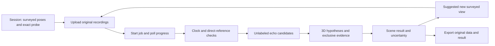

# Frontend handoff v1

The backend's central claim is that sound can support several independently located 3D reflectors, including height-dependent structure, and that additional surveyed recording positions can resolve or strengthen that inference. It does not claim complete object meshes, measured edges, safe free space or hardware accuracy. The useful demonstration is understanding room layout and consequential early reflections, with visible evidence behind every surface.

## Start with these interfaces

Run `python -m echosight serve --root work/store --port 8765`. [API.md](API.md) specifies the routes, error codes and limits. The pure processing interface is `echosight.pipeline.process_session(session_or_path, cancel, progress)`. JSON schemas are in `schemas/`: session, job and scene result, all `schema_version="1.0"`. Keep session IDs, capture IDs, candidate IDs and result IDs in frontend state. The API currently accepts trusted local clients; a browser frontend needs a deliberate allowed-origin/authentication design or a same-machine server proxy. Do not make this unauthenticated local service public.



Job status and scene status mean different things. A `completed` job may legitimately return `no_result`. Job statuses are `queued`, `running`, `completed`, `failed`, `cancelled`, `interrupted`; scene statuses are `ok`, `partial`, `ambiguous`, `no_result`, `cancelled`. A percentage describes work progress, never confidence. On restart, interrupted jobs retain input and recordings; start a new job. After another capture is uploaded, an earlier scene is marked `stale=true` until reprocessed.

## Render the actual geometry

All positions use metres, right-handed coordinates, z up. A surface has unit `normal` n and `offset_m` d satisfying n·x=d. `vertices_m` and zero-based `triangles` can populate a mesh directly. Render the source and receiver poses using the same coordinate frame. Surface polygons summarize the convex hull of supported reflection points. Their boundary is **not an inferred physical edge**. Keep `extent_status="unknown"` visible; do not connect patches into a closed room or extrude a floor plan.

Each surface's `support` links a `capture_id` and `candidate_id` to its observed and predicted excess delay, residual and reflection point. Draw source → reflection point → receiver rays when selected. Display measured/predicted delays in milliseconds only by multiplying the stored seconds by 1000. These times are corrected source-buffer intervals; the declared source-clock scale is still needed for physical seconds. Color or opacity may summarize support, but there is no calibrated probability of correctness.

`uncertainty.offset_std_m` and `normal_angular_std_rad` are local standard deviations conditional on one path assignment and first-order point-source model. They include declared shared calibration covariance. They exclude unmodeled source/recorder bias and alternative global explanations. Do not label ±1.96 standard deviations a universally validated 95% interval. `dimensions` are separations of nearly parallel supported planes, not proof of enclosed room dimensions. Their uncertainty uses the shared covariance.

When `status="ambiguous"`, definitive `surfaces` is empty. Keep `hypotheses` separate. A hypothesis may contain `surfaces`, `planes` or `image_sources_m`; render available support without inventing extents for a bare plane. Unconfirmed candidates belong in an explicitly qualified overlay, never mixed with confirmed surfaces. Diagnostics may be a code string or `{code,message}`; show the message if present and preserve the code for troubleshooting.

## Evolving the map

Upload additional captures to the same session, then start a new job. Existing recordings are immutable and remain included. Compare saved results with `POST /v1/compare` or `python -m echosight compare old.json new.json --output comparison.json`. The same `coordinate_frame_id`, source, probe and scale are required. Pipeline results default the frame to the session ID; cross-session comparisons require the caller to supply the same surveyed frame explicitly.

`correspondences` supplies a persistent frontend `track_id` across changing surface evidence IDs. Surface IDs hash supporting capture/candidate IDs and can change after refinement. The comparison reports additional support, newly supported surfaces, prior surfaces that are no longer confirmed, and ambiguity reduction. It always distinguishes inference changes from physical scene changes. A disappearing estimate does not establish a removed object.

`recommend_next_view(session,result,candidate_positions_m)` scores supplied reachable positions by predicted separation of competing image-source explanations, normalized by declared timing/pose uncertainty. It does not inspect room truth or guarantee echo visibility. A frontend can show the recommended surveyed position, the predicted delay difference and the residual ambiguity after the recording arrives. Later physical scene-change claims need stable repeated A→B→A recordings, qualified devices and independent geometric support.

## Repeatable demonstrations

```sh
python -m echosight demo work/room --seed 1 --captures 12
python -m echosight demo work/reflector --scenario reflector --seed 1 --captures 12
python -m echosight refine-demo work/refinement --seed 1 --captures 12
python -m echosight demo work/ambiguous --scenario coplanar --seed 4
python -m echosight demo work/empty-evidence --scenario null --seed 1
python -m evaluation.guidance --output work/guidance
```

Tell the audience which evidence is simulated, external measured-response replay, supplied calibration, or our own measurement. At present the first two exist and the last does not. The simulator's separate `truth.json` is evaluation-only. A future live frontend must never feed its contents to the mapper or imply that supplied geometry was acoustically recovered.

Use the held-out reports for performance claims. A useful narrative is: start with insufficient or ambiguous evidence; show an additional surveyed placement; reveal newly supported 3D structure and its rays; inspect a residual and uncertainty; finish with what remains unknown. The tilted-reflector experiment is conditional and has documented misses. No first-ever claim or competition outcome is asserted.
